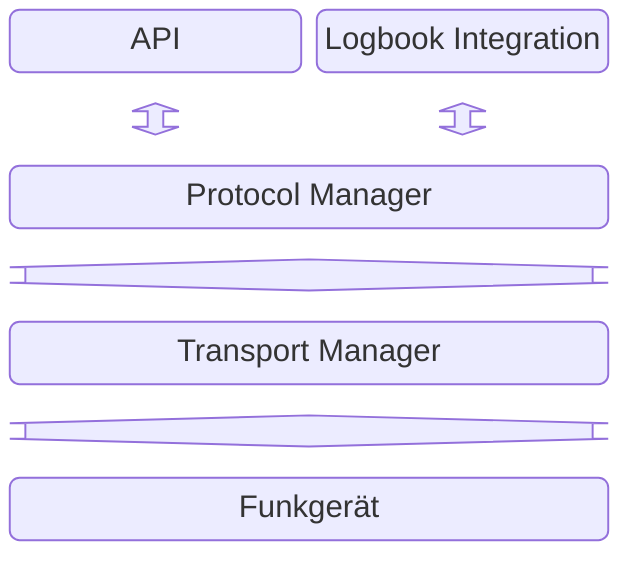
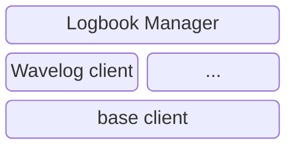
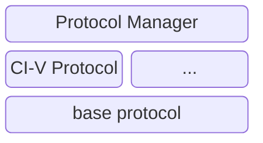
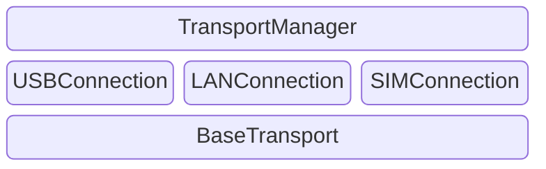
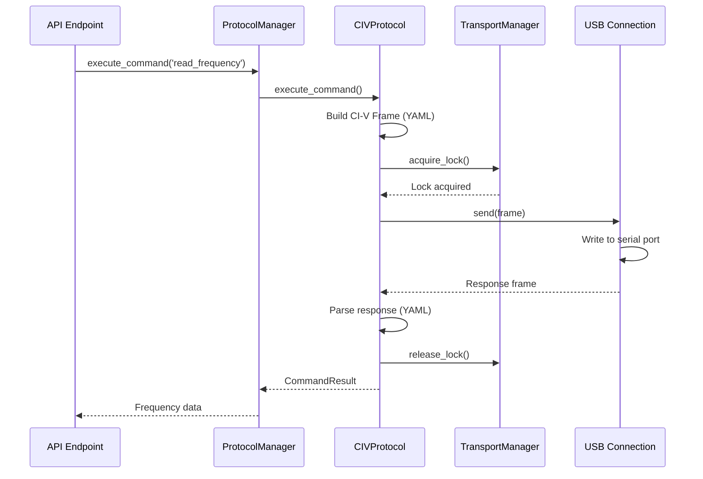
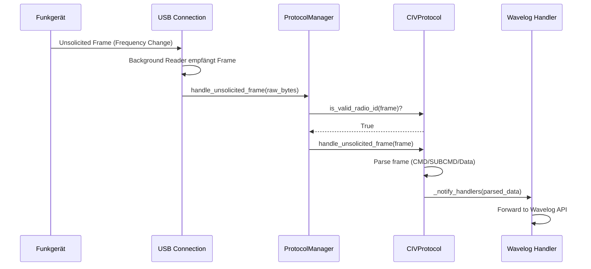

# RigBridge - Architektur-Design

RigBridge folgt einem **Clean Architecture** Ansatz mit mehrschichtiger Architektur und zentraler Ressourcen-Verwaltung:


## Gesamtarchitektur




## API Layer ([`routes.py`](../src/backend/api/routes.py))

- **REST Endpoints**: `/api/rig/frequency`, `/api/rig/mode`, etc.
- **Async/Await**: Alle Endpoints sind asynchron
- **Keine direkte Hardware-Logik**: Delegiert an ProtocolManager

**Endpoint-Typen**:
1. **Generische Command API**: `GET/PUT /api/rig/command` - für alle YAML-Befehle
2. **Convenience Endpoints**: Spezifische APIs für häufige Operationen (Frequenz, Mode)
3. **Status/Info**: `/api/status`, `/api/commands`

**Dokumentation**: [API.md](API.md)


## Logbook Integration

### Zweck

Die **Logbook-Integration** ist die zentrale Verwaltungsschicht für die Anbindung externer Logbuch-Systeme.
Ihre Hauptaufgaben sind:
- **Entkopplung der Logbuch-Protokolle**: Einheitliche Schnittstelle über `BaseLogbookClient` statt Anbieterlogik in API/Protocol.
- **Zentrales Status-Caching**: Zwischenspeicherung von Frequenz, Modus und Leistung mit Zeitstempel und Sequenznummer.
- **Debounced Versandsteuerung**: Verzögerter Versand nur bei stabilen Daten (konfigurierbar, aktuell auf 1-5 Sekunden begrenzt).
- **Coalescing/Idempotenz**: Verhindert redundante Sends und verwirft veraltete geplante Updates.
- **Erweiterbarkeit**: Mehrere Logbuch-Adapter (Wavelog, weitere Systeme) können parallel verwaltet werden.


### Architektur ([`src/backend/logbook/`](../src/backend/logbook))




## Protocol Layer ([`src/backend/protocol/`](../src/backend/protocol/))

**CIVProtocol** implementiert das CI-V-Protokoll für ICOM Funkgeräte.

### Architektur



### Protocol Manager ([`protocol_manager.py`](../src/backend/protocol/protocol_manager.py))

#### Zweck

Der **ProtocolManager** ist die zentrale Verwaltungsschicht für Funkgerät-Protokolle.
Seine Hauptaufgaben sind:
- **Protokoll-Abstraktion**: Entkoppelt API von Protokoll-Details (CI-V, CAT, HAMLib)
- **Command-Dispatch**: Leitet Befehle an aktives Protokoll weiter
- **Unsolicited Frame Handling**: Empfängt und validiert unsolicited frames vom Transport
- **Wavelog-Integration**: Vorbereitung für automatische Status-Weiteleitung
- **Singleton-Pattern**: Systemweit nur eine Instanz


## Transport Manager ([`transport_manager.py`](../src/backend/transport/transport_manager.py))

### Zweck

Der **TransportManager** ist die zentrale Verwaltungsschicht für alle physischen Verbindungen zum Funkgerät (USB, später LAN, etc.).
Seine Hauptaufgaben sind:
- **Ressourcen-Synchronisation**: Verhindert Race Conditions durch globales `asyncio.Lock()`
- **Timeout-Management**: Konfigurierbare Wartezeiten für Health-Checks und API-Befehle
- **Transport-Abstraktion**: Ermöglicht einfachen Wechsel zwischen USB, LAN und anderen Transport-Typen ohne API-Änderungen

### Architektur



**Dokumentation**: [TRANSPORT_MANAGER.md](TRANSPORT_MANAGER.md)


## Datenfluss-Diagramme

### Request-Flow (API → Funkgerät)



### Unsolicited Frame Flow (Funkgerät → Handlers)




## Konfiguration

**Hauptdatei**: [`config.json`](../config.json)

**Struktur**:
```json
{
  "device": {
    "name": "IC-905",
    "protocol": "civ"
  },
  "usb": {
    "port": "COM4",
    "baud_rate": 19200,
    "timeout": 1.0
  },
  "api": {
    "host": "0.0.0.0",
    "port": 8000
  }
}
```


## Testing-Strategie

### Test-Hierarchie

1. **Unit Tests**: Isolierte Komponenten
   - `test_protocol_manager.py` - ProtocolManager Tests
   - `test_civ_protocol.py` - CIVProtocol Tests
   - `test_api_config.py` - Configuration Tests

2. **Integration Tests**: Komponenten-Zusammenspiel
   - `test_integration.py` - End-to-End Tests ohne Hardware
   - `test_api_frontend.py` - API Endpoint Tests

3. **Simulation Tests**: Ohne echte Hardware
   - `test_3_usb_simulation/` - USB-Simulation

4. **Hardware Tests**: Mit echtem Funkgerät
   - `test_4_usb_real_hardware/` - Real-Hardware Tests (manuell)

**Test-Ausführung**:
```bash
# Alle Tests ohne Hardware
pytest tests/backend -m "not usb_real"

# Nur Unit Tests
pytest tests/backend -m "unit"

# Protocol Manager Tests
pytest tests/backend/test_protocol_manager.py -v
```


## Verwandte Dokumentation

- [PROTOCOL_MANAGER.md](PROTOCOL_MANAGER.md) - Protocol Manager Details
- [TRANSPORT_MANAGER.md](TRANSPORT_MANAGER.md) - Transport Manager Details
- [API.md](API.md) - REST API Dokumentation
- [BACKEND_DEVELOPMENT.md](BACKEND_DEVELOPMENT.md) - Entwicklungsanleitung
- [USB.md](USB.md) - USB-Verbindung Details
- [WAVELOG_CAT_IMPLEMENTATION.md](WAVELOG_CAT_IMPLEMENTATION.md) - Wavelog Integration
