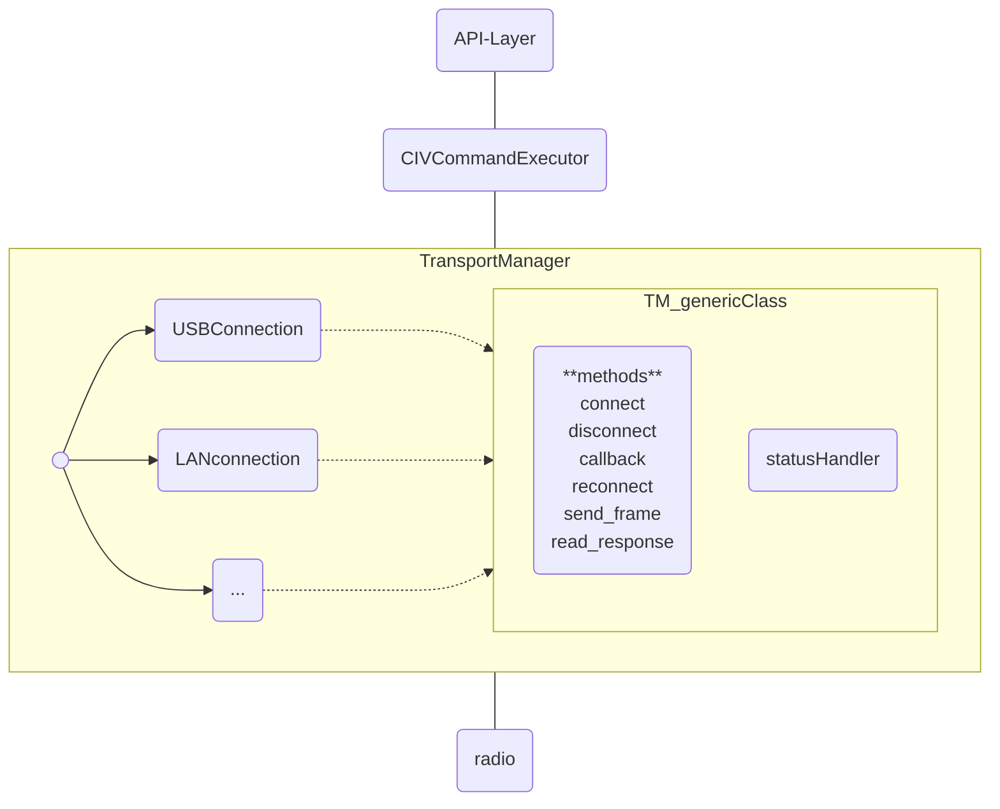

# RigBridge - Architektur-Design mit TransportManager

RigBridge folgt einem **Clean Architecture** Ansatz mit zentraler Ressourcen-Verwaltung:


## API ([routes.py](../src/backend/api/routes.py))
- Async Endpoints (/rig/frequency, etc)
- Keine Semaphore-Code
- Einfach: await executor.execute_command()

Für mehr Informationen: [REST API Dokumentation](API.md)

## CIVCommandExecutor ([executor.py](../src/backend/civ/executor.py))
- Befehlsaufbau & -ausführung
- ASYNC: execute_command()
- Nutzt TransportManager automatisch

## 🔐 TransportManager: Das Herzstück

TransportManager (transport_manager.py)
- Zentrale Resource-Verwaltung
- asyncio.Lock() für Mutual Exclusion
- Timeouts: Health-Check 5s, API 10s
- Verhindert Race Conditions

Er ist verantwortlich für:

### 1. Mutual Exclusion (Gegenseitiger Ausschluss)
```python
# Nur EIN Befehl zur Zeit hat Zugriff auf USB
_resource_lock = asyncio.Lock()

# Wenn API-Request und Health-Check gleichzeitig versuchen:
# ✅ Einer wartet, der andere führt aus
# ❌ NICHT beide gleichzeitig (würde Datenkorruption verursachen)
```

### 2. Timeout-basierte Deadlock-Prevention
```python
# Health-Check: max 5 Sekunden (nicht blockieren)
timeout = self.health_check_timeout  # 5.0s

# API-Befehle: max 10 Sekunden (User wartet)
timeout = self.command_timeout  # 10.0s

# Falls Lock nicht in Zeit erworben:
# → HTTPException(503 Service Unavailable)
```

### 3. Seamless Operation Logging
```python
# Jede Operation ist dokumentiert:
logger.debug(f"Exclusive access acquired for: read_frequency")
logger.warning(f"USB lock timeout for: set_operating_frequency")
logger.debug(f"Exclusive access released")
```
### connection class
Noch nicht implementiert.

### USBConnection ([usb_connection.py](../src/backend/transport/usb_connection.py))
- Low-level Serial I/O
- Keine Synchronisation nötig
- Nur geschützer Zugriff durch Lock

### LANconnection
Noch nicht implementiert.

### Erweiterungen

Davon, dass wir TransportManager haben, profitieren wir später:

```python
# Heute: USB-Transport
transport = TransportManager(
    usb_connection=USBConnection(config.usb)
)

# Morgen: LAN-Transport (einfach hinzufügbar!)
transport = TransportManager(
    lan_connection=LANConnection(config.lan)
)

# Die API bleibt komplett gleich:
result = await executor.execute_command('read_frequency')
# TransportManager entscheidet: USB oder LAN? Egal!
```

## 📊 Beispiel: Wie Race-Conditions verhindert werden

### VORHER (ohne TransportManager)
```
Zeit    API-Thread              Health-Check Thread
────────────────────────────────────────────────
T0:     send "get frequency"    
T1:                             send "health check"
T2:     read response    ← FALSCH! Antwortet auf Health-Check!
        Fehler: "Unknown command"
T3:                             read response ← Got API Frequency!
```

### NACHHER (mit TransportManager)
```
Zeit    API-Thread              Health-Check Thread
────────────────────────────────────────────────
T0:     acquire_lock() ✅       acquire_lock() → wartet!
T1:     send "get frequency"    (blockiert...)
T2:     read response ✅        
T3:     release_lock()          acquire_lock() ✅
T4:                             send "health check"
T5:                             read response ✅
        ✅ Beide funktionieren korrekt!
```

## 🔄 Async/Await Pattern

ALLE Befehlsaufrufe müssen `async` sein:

```python
# ✅ RICHTIG - routes.py
@router.get("/rig/frequency")
async def get_frequency() -> FrequencyResponse:
    executor = get_executor()
    result = await executor.execute_command('read_operating_frequency')
    return FrequencyResponse(frequency_hz=result.data['frequency'])

# ❌ FALSCH - vergessenes await
@router.get("/rig/frequency")
async def get_frequency():
    executor = get_executor()
    result = executor.execute_command('read_frequency')
    # → "Coroutine was never awaited" Fehler!
    return result
```

## 🧪 Tests mit Async

Alle Tests, die `execute_command()` aufrufen, müssen `async` sein:

```python
# ✅ RICHTIG
@pytest.mark.asyncio
async def test_frequency_read(executor):
    result = await executor.execute_command('read_operating_frequency')
    assert result.success
    assert result.data['frequency'] > 0

# ❌ FALSCH
def test_frequency_read(executor):
    result = executor.execute_command('read_operating_frequency')
    # → RuntimeWarning: coroutine was never awaited
```

## 🔗 Verwandte Dokumentation

- [BACKEND_DEVELOPMENT.md](BACKEND_DEVELOPMENT.md) - Entwicklungsanleitung
