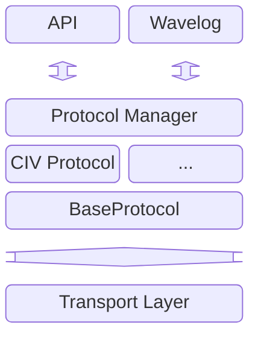
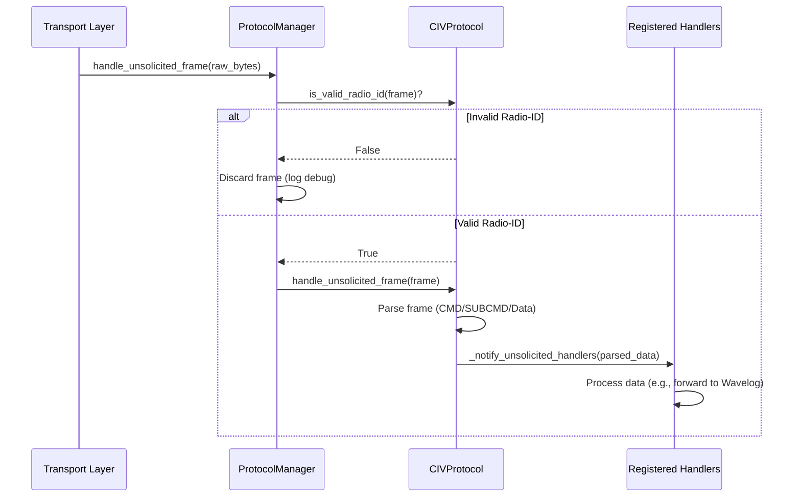
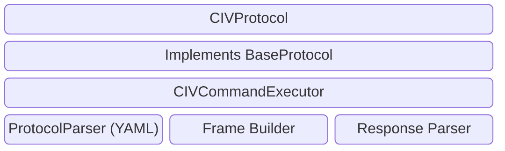

# Protocol Manager

## 1. Zweck

Der **ProtocolManager** ist die zentrale Abstraktionsschicht für Funkgerät-Protokolle.
Er entkoppelt die API-Logik von protokollspezifischen Details (CI-V, CAT, HAMLib) und koordiniert:

### Kernverantwortlichkeiten
1. **Protokoll-Verwaltung**: Singleton-Pattern für systemweite Protokoll-Instanz
2. **Command-Dispatch**: Leitet API-Befehle an aktives Protokoll weiter
3. **Unsolicited Frame Handling**: Empfängt und validiert unsolicited frames vom Transport
4. **Wavelog-Integration**: Vorbereitung für automatische Status-Weiteleitung
5. **Convenience-API**: Häufig verwendete Operationen (Frequenz, Mode, Power)

### Architektur


---

## 2. BaseProtocol - Abstrakte Basisklasse ([`base_protocol.py`](../src/backend/protocol/base_protocol.py))

### Konzept

Die `BaseProtocol` Klasse definiert die gemeinsame Schnittstelle für alle Protokoll-Implementierungen:

**Hauptverantwortlichkeiten**:
- Generische Command-Ausführung (YAML-basiert)
- Convenience-Methoden für häufige Operationen
- Unsolicited Frame Handling mit Callback-System
- Radio-ID-Validierung

**Kernattribute**:
- `protocol_file`: Pfad zur YAML-Protokolldefinition
- `manufacturer_file`: Optionaler Pfad zur Hersteller-YAML
- `_unsolicited_handlers`: Liste registrierter Callbacks für unsolicited data

### Hauptmethoden

| Methode | Typ | Beschreibung |
|---------|-----|-------------|
| `execute_command()` | async, abstract | Führt generischen Befehl aus YAML aus |
| `list_commands()` | abstract | Gibt alle verfügbaren Befehle zurück |
| `is_valid_radio_id()` | abstract | Prüft ob Frame von erwarteter Radio-ID stammt |
| `handle_unsolicited_frame()` | async, abstract | Verarbeitet unsolicited Frame vom Funkgerät |
| `get_frequency()` | async | Liest aktuelle Betriebsfrequenz |
| `get_mode()` | async | Liest aktuellen Betriebsmodus |
| `get_power()` | async | Liest aktuelle Sendeleistung (VORBEREITET) |
| `supports_power()` | | Prüft ob Power-Befehle unterstützt werden |
| `register_unsolicited_handler()` | | Registriert Callback für unsolicited data |

### CommandResult - Rückgabe-Struktur

**Dataclass für Befehlsergebnisse**:
```python
@dataclass
class CommandResult:
    success: bool                          # True bei Erfolg
    data: Optional[Dict[str, Any]] = None  # Geparste Daten
    error: Optional[str] = None            # Fehlermeldung
    raw_response: Optional[bytes] = None   # Rohe Antwort
```

**Verwendungsbeispiel**:
```python
result = await protocol.execute_command('read_operating_frequency')
if result.success:
    frequency = result.data['frequency']  # in Hz
else:
    logger.error(result.error)
```

---

## 3. ProtocolManager - Zentrale Verwaltung ([`protocol_manager.py`](../src/backend/protocol/protocol_manager.py))

### Konzept

**Singleton-Pattern**: Systemweit nur eine Instanz, verwaltet aktives Protokoll.

**Architektur-Position**:
```
API Layer (routes.py)
    ↓
ProtocolManager (Singleton)
    ↓
BaseProtocol Implementation (CIVProtocol, etc.)
    ↓
TransportManager
    ↓
Transport Layer (USB, LAN)
```

### Hauptmethoden

#### Protokoll-Verwaltung

| Methode | Beschreibung |
|---------|-------------|
| `set_protocol(protocol)` | Setzt aktives Protokoll |
| `get_protocol()` | Gibt aktives Protokoll zurück |
| `has_protocol()` | Prüft ob Protokoll gesetzt ist |

#### Command-Dispatch

| Methode | Parameter | Rückgabe | Beschreibung |
|---------|-----------|----------|-------------|
| `execute_command()` | `command_name`, `data`, `is_health_check` | `CommandResult` | Führt generischen Befehl aus |
| `list_commands()` | - | `List[str]` | Gibt alle verfügbaren Befehle zurück |

#### Convenience-Methoden

| Methode | Rückgabe | Beschreibung |
|---------|----------|-------------|
| `get_frequency()` | `Optional[int]` | Frequenz in Hz |
| `get_mode()` | `Optional[str]` | Betriebsmodus (z.B. 'USB', 'CW') |
| `get_power()` | `Optional[float]` | Sendeleistung in Watt (VORBEREITET) |
| `supports_power()` | `bool` | Prüft Power-Support |

#### Unsolicited Frame Handling

| Methode | Beschreibung |
|---------|-------------|
| `handle_unsolicited_frame(frame)` | Empfängt Frame vom Transport, validiert Radio-ID, leitet an Protokoll weiter |
| `register_unsolicited_handler(handler)` | Registriert Callback für geparste unsolicited data |
| `unregister_unsolicited_handler(handler)` | Entfernt registrierten Handler |

#### Debug & Inspection

| Methode | Rückgabe | Beschreibung |
|---------|----------|-------------|
| `get_protocol_info()` | `Dict[str, Any]` | Protokoll-Details (Typ, Commands, Features) |

### Workflow: Unsolicited Frame Handling

**Flow**: Transport Background Reader → ProtocolManager → Protocol → Handlers



**Schritte**:
1. Transport Background Reader empfängt unsolicited Frame
2. ProtocolManager prüft Radio-ID (verhindert falsche Frames)
3. Protokoll parst Frame-Inhalt (Frequenz, Mode, etc.)
4. Registrierte Handler werden benachrichtigt (z.B. Wavelog-Forward)

---

## 4. CIVProtocol - CI-V Implementierung ([`civ_protocol.py`](../src/backend/protocol/civ_protocol.py))

### Konzept

**CIVProtocol** implementiert `BaseProtocol` für das CI-V Protokoll (ICOM Funkgeräte).

**Design-Pattern**: Delegation an internen `CIVCommandExecutor` für Frame-Building und Parsing.

### Architektur



### CI-V Frame-Struktur

**Unsolicited Frame (Radio → PC)**:
```
[Preamble(2)] [Controller(1)] [Radio(1)] [CMD] [SUBCMD?] [DATA...] [Terminator]
    0xFE 0xFE      0xE0           0xA4     0x00    ...       ...        0xFD
```

**Request Frame (PC → Radio)**:
```
[Preamble(2)] [Radio(1)] [Controller(1)] [CMD] [SUBCMD?] [DATA...] [Terminator]
    0xFE 0xFE     0xA4        0xE0         0x03    ...       ...        0xFD
```

### Hauptmethoden

| Methode | Beschreibung |
|---------|-------------|
| `set_usb_connection()` | Verknüpft USB-Connection mit Protokoll |
| `execute_command()` | Delegiert an `CIVCommandExecutor` |
| `list_commands()` | Gibt Commands aus YAML-Parser zurück |
| `is_valid_radio_id()` | Prüft Preamble + Radio-Adresse |
| `handle_unsolicited_frame()` | Parst CMD/SUBCMD, extrahiert Daten, benachrichtigt Handler |
| `get_radio_address()` | Liefert CI-V Radio-Adresse (z.B. 0xA4) |
| `get_controller_address()` | Liefert CI-V Controller-Adresse (z.B. 0xE0) |

### Radio-ID-Validierung

**Logik in `is_valid_radio_id()`**:
1. Prüfe Mindestlänge (≥6 Bytes)
2. Prüfe Preamble (0xFE 0xFE)
3. Extrahiere Radio-Adresse (Position 3 bei unsolicited frames)
4. Vergleiche mit erwarteter Radio-Adresse aus YAML

**Beispiel**:
```python
frame = bytes([0xFE, 0xFE, 0xE0, 0xA4, 0x03, 0x00, 0xFD])
#                 ^preamble  ^ctrl ^radio ^cmd ...

is_valid = protocol.is_valid_radio_id(frame)
# True wenn Radio-Adresse (0xA4) mit YAML übereinstimmt
```

---

## 5. API-Integration

### Verwendung in routes.py

**Initialisierung** (beim App-Start):
```python
from src.backend.protocol import ProtocolManager, CIVProtocol

# Singleton erstellen
protocol_manager = ProtocolManager()

# Protokoll initialisieren
protocol = CIVProtocol(
    protocol_file=Path('protocols/manufacturers/icom/ic905.yaml'),
    manufacturer_file=Path('protocols/manufacturers/icom/icom.yaml')
)

# USB-Connection verknüpfen
usb_conn = USBConnection(config.usb)
protocol.set_usb_connection(usb_conn)

# Protokoll setzen
protocol_manager.set_protocol(protocol)

# Unsolicited Frame Handler registrieren
def unsolicited_frame_handler(frame_data):
    raw_bytes = frame_data.raw_bytes
    asyncio.create_task(protocol_manager.handle_unsolicited_frame(raw_bytes))

usb_conn.register_unsolicited_handler(unsolicited_frame_handler)
```

### Generische Command API

**Endpoints**:
- `GET /api/rig/command?name=<command>` - Lese-Befehl ausführen
- `PUT /api/rig/command` - Schreib-Befehl ausführen (Body: `{command, data}`)

**Beispiel GET**:
```python
@router.get('/rig/command')
async def execute_generic_command_get(name: str = Query(...)):
    protocol_manager = get_protocol_manager()
    result = await protocol_manager.execute_command(name)
    
    if result.success:
        return CommandResponse(success=True, command=name, data=result.data)
    else:
        raise HTTPException(status_code=400, detail=result.error)
```

**Beispiel PUT**:
```python
@router.put('/rig/command')
async def execute_generic_command_put(request: GenericCommandRequest):
    protocol_manager = get_protocol_manager()
    result = await protocol_manager.execute_command(
        command_name=request.command,
        data=request.data
    )
    # ... (analog GET)
```

### Convenience Endpoints

**Spezifische APIs für häufige Operationen**:
- `GET /api/rig/frequency` - Liest Betriebsfrequenz
- `GET /api/rig/mode` - Liest Betriebsmodus
- `GET /api/rig/power` - Liest Sendeleistung (VORBEREITET)
- `GET /api/rig/s-meter` - Liest S-Meter-Wert

**Beispiel Frequency**:
```python
@router.get('/rig/frequency', response_model=FrequencyResponse)
async def get_frequency():
    protocol_manager = get_protocol_manager()
    frequency = await protocol_manager.get_frequency()
    
    if frequency is not None:
        return FrequencyResponse(frequency_hz=frequency)
    else:
        raise HTTPException(status_code=400, detail='Failed to read frequency')
```

---

## 6. Wavelog-Integration (Vorbereitung)

### Konzept

**Ziel**: Automatische Weiterleitung von Funkgerät-Status-Änderungen an Wavelog.

**Flow**: Funkgerät sendet unsolicited frame → ProtocolManager → Handler → Wavelog API

### Handler-Registrierung

**Beispiel für zukünftige Wavelog-Integration**:
```python
def wavelog_auto_forward_handler(parsed_data: Dict[str, Any]):
    """
    Empfängt geparste unsolicited data und leitet an Wavelog weiter.
    
    Args:
        parsed_data: Dict mit Keys wie 'frequency', 'mode', 'power'
    """
    if 'frequency' in parsed_data and 'mode' in parsed_data:
        frequency_hz = parsed_data['frequency']
        mode = parsed_data['mode']
        
        # Wavelog API-Call (zukünftig)
        # await wavelog_client.send_radio_status(
        #     frequency_hz=frequency_hz,
        #     mode=mode
        # )
        
        logger.info(
            f'Wavelog forward: {frequency_hz} Hz, {mode}'
        )

# Registrierung
protocol_manager = ProtocolManager()
protocol_manager.register_unsolicited_handler(wavelog_auto_forward_handler)
```

### Aktueller Status

**Phase 1 (✅ Abgeschlossen)**:
- Callback-Struktur implementiert
- Handler-Registrierung funktioniert
- Unsolicited Frame Flow: Transport → ProtocolManager → Protocol → Handlers

**Phase 2 (⏳ Ausstehend)**:
- Vollständiges Frame-Parsing (YAML-basierte Frequency/Mode-Extraktion)
- Wavelog Client-Implementierung
- Tatsächliche Auto-Forward-Logik

---

## 7. Erweiterbarkeit

### Neues Protokoll hinzufügen

**Schritte**:
1. Neue Klasse erstellen, die `BaseProtocol` erweitert
2. Abstrakte Methoden implementieren (`execute_command`, `list_commands`, etc.)
3. YAML-Protokolldefinition erstellen
4. In `ProtocolManager.set_protocol()` aktivieren

**Beispiel CAT-Protokoll**:
```python
from src.backend.protocol.base_protocol import BaseProtocol, CommandResult

class CATProtocol(BaseProtocol):
    """CAT Protocol implementation (Yaesu, Kenwood)."""
    
    def __init__(self, protocol_file: Path):
        super().__init__(protocol_file)
        # CAT-spezifische Initialisierung
    
    async def execute_command(self, command_name: str, data=None, is_health_check=False):
        # CAT-spezifische Command-Ausführung
        pass
    
    def list_commands(self):
        # CAT-Commands auflisten
        pass
    
    def is_valid_radio_id(self, frame: bytes):
        # CAT-spezifische Frame-Validierung
        pass
    
    async def handle_unsolicited_frame(self, frame: bytes):
        # CAT-spezifisches Unsolicited Handling
        pass
```

**Aktivierung**:
```python
protocol = CATProtocol(protocol_file=Path('protocols/cat/cat_protocol.yaml'))
protocol_manager.set_protocol(protocol)
```

---

## 8. Testing

### Unit Tests

**Dateien**:
- `tests/backend/test_protocol_manager.py` - ProtocolManager Tests
- `tests/backend/test_civ_protocol.py` - CIVProtocol Tests

**Test-Coverage**:
- Singleton-Pattern
- Protocol-Verwaltung (set/get)
- Command-Dispatch
- Unsolicited Frame Handling
- Radio-ID-Validierung
- Handler-Registrierung

**Ausführung**:
```bash
pytest tests/backend/test_protocol_manager.py -v
pytest tests/backend/test_civ_protocol.py -v
```

### Integration Tests

**Szenarios**:
- End-to-End Command-Ausführung mit echtem Protokoll
- Mehrere Commands in Sequenz
- Unsolicited Frame Handling mit registrierten Handlern

---

## 9. Debugging & Troubleshooting

### Protocol Info abrufen

```python
protocol_manager = ProtocolManager()
info = protocol_manager.get_protocol_info()

print(f"Active: {info['active']}")
print(f"Type: {info['protocol_type']}")
print(f"Commands: {len(info['supported_commands'])}")
print(f"Supports Power: {info['supports_power']}")
```

### Logging

**Log-Level für Protocol Layer**:
```python
logger = RigBridgeLogger.get_logger('src.backend.protocol')
logger.setLevel('DEBUG')
```

**Wichtige Log-Messages**:
- Protocol initialization: `"CIVProtocol initialized with X commands"`
- Unsolicited frame validation: `"Unsolicited frame discarded: Invalid Radio-ID"`
- Command execution: `"Command execution failed: <error>"`

---

## 🔗 Verwandte Dokumentation

- [ARCHITECTURE.md](ARCHITECTURE.md) - Gesamtarchitektur
- [TRANSPORT_MANAGER.md](TRANSPORT_MANAGER.md) - Transport Layer
- [API.md](API.md) - REST API Dokumentation
- [BACKEND_DEVELOPMENT.md](BACKEND_DEVELOPMENT.md) - Entwicklungsanleitung
