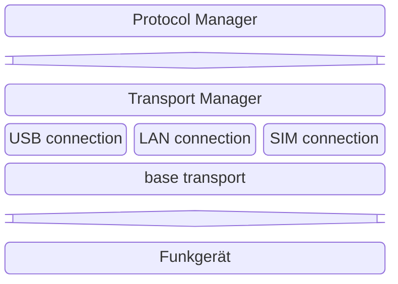
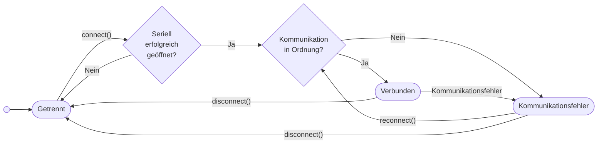

# Transport Manager

## 1. Zweck

Der **TransportManager** ist die zentrale Abstraktionsschicht für die physische Kommunikation mit dem Funkgerät.
Er entkoppelt die API-Logik von Verbindungsdetails (USB, LAN, SIM) und verhindert Synchronisationsprobleme durch:

### Kernverantwortlichkeiten
1. **Ressourcen-Synchronization**: Globales `asyncio.Lock()` verhindert gleichzeitige Zugriffe
2. **Timeout-Management**: Unterschiedliche Timeouts für kritische vs. normale Operationen
3. **Transport-Abstraktion**: Einfacher Wechsel zwischen Protokollen ohne API-Änderungen
4. **Fehlerbehandlung**: Logging und Zustandsverwaltung

### Architektur


---

## 2. BaseTransport inkl. ConnectionState

### BaseTransport - Abstrakte Basisklasse ([`src/backend/transport/base_transport.py`](../src/backend/transport/base_transport.py))

Die `BaseTransport` Klasse definiert die gemeinsame Schnittstelle für alle Transport-Implementierungen:

**Konzept**: Abstrakte Basisklasse für Schnittstelle zum:
- Verbindungsmanagement (`connect()`, `disconnect()`, `reconnect()`)
- Frame-Übertragung (`send()`, `receive()`)
- Unsolicited Frame Handling (Callbacks für unerwartete Daten vom Gerät)
- Status-Management (Integration mit `ConnectionState`)

**Kernattribute**:
- `transport_type`: Bezeichnung des Transport-Typs ("USB", "LAN", etc.) für Logging
- `state`: `ConnectionState` Instanz für Zustandsverwaltung
- `last_error`: Fehlerstring des letzten Vorfalls
- `_unsolicited_handlers`: Liste registrierter Callbacks für unerwartete Frames

**Hauptmethoden**:
| Methode | Beschreibung |
|---------|-------------|
| `connect() -> bool` | Stellt Verbindung her |
| `disconnect() -> None` | Beendet Verbindung |
| `reconnect() -> bool` | Beendet Verbindung und stellt sie wieder her |
| `send(data: FrameData) -> bool` | Sendet Daten an Gerät |
| `receive() -> Optional[FrameData]` | Empfängt Daten vom Gerät |
| `is_connected() -> bool` | Prüft Verbindungsstatus |
| `register_unsolicited_handler()` | Registriert Callback für unangefragte Daten |

**FrameData - Generische Datenkapsel**:

Definiert Struktur für Transport-Frames über alle Protokolle:
- `raw_bytes`: Rohe Bytes des Frames in hexadezimaler oder binärer Form (CI-V, CAT, etc.)
- `timestamp`: Automatisch gesetzter Zeitstempel für Empfang/Versand (UNIX-Zeit)

---

### ConnectionState - Zustandsmaschine ([`src/backend/transport/connection_state.py`](../src/backend/transport/connection_state.py))

`ConnectionState` verwaltet den Verbindungsstatus mit State-Machine-Pattern:

**Status-Enum - TransportStatus**:

| Status | Bedeutung |
|--------|-----------|
| `DISCONNECTED` | Keine Verbindung verfügbar / kann nicht geöffnet werden |
| `COMMUNICATION_ERROR` | Fehler bei Kommunikation (z.B. I/O Fehler, Timeout) |
| `CONNECTED` | Gerät verbunden und antwortet auf Befehle |

**Status-Enum - TransportStatus**:

`ConnectionState` verwaltet drei Zustandswerte:
- `DISCONNECTED`: Keine Verbindung verfügbar / kann nicht geöffnet werden
- `COMMUNICATION_ERROR`: Fehler bei Kommunikation (z.B. I/O Fehler, Timeout)
- `CONNECTED`: Gerät verbunden und antwortet auf Befehle

**Funktionalität**:
- `status`: Aktuelles TransportStatus Enum (initial: `DISCONNECTED`)
- `last_error`: Fehlerstring für Diagnostik
- `update_status(new_status, connection_info, error)`: Setter mit automatischem Logging
  - Loggt Übergänge strukturiert: z.B. "USB: DISCONNECTED → CONNECTED (COM3 @ 19200 baud)"

**Status-Übergänge (Flowchart)**:


---

## 3. USB Connection ([`usb_connection.py`](../src/backend/transport/usb_connection.py))

### Zweck
Implementiert `BaseTransport` für serielle USB-Verbindungen mit automatischem Reconnect und CI-V Protokoll-Support.

### Implementierung

**Konzept**: `USBConnection` erweitert `BaseTransport` für Seriell-Verbindungen mit:
- Automatischem Reconnect bei Fehlern
- Konfigurierbare Parameter (Baudrate, Timeout, Parity, etc.)
- Simulationsmodus für Tests (kein echtes Gerät nötig)
- Integrationspunkte für zukünftige Protokolle

### Konfigurationsparameter (USBConfig)

| Parameter | Typ | Beschreibung | Beispiel |
|-----------|-----|-------------|----------|
| `port` | str | Serial Port / Device | "COM3" (Windows), "/dev/ttyUSB0" (Linux) |
| `baud_rate` | int | Übertragungsgeschwindigkeit | 19200 |
| `timeout` | float | Read/Write Timeout in Sekunden | 1.0 |
| `data_bits` | int | Datenbits pro Zeichen | 8 |
| `stop_bits` | int | Stoppbits | 1 |
| `parity` | str | Paritätsbit Format | "N" (None), "E" (Even), "O" (Odd) |

### Workflow: Verbindung herstellen


### Workflow: Verbindung herstellen

**`connect()` Prozess**:
1. Versucht serielle Verbindung zu öffnen mit Parametern aus `USBConfig` (Port, Baudrate, Timeout, etc.)
2. Bei Erfolg: Setzt `ConnectionState` auf `CONNECTED` mit Verbindungsinfo (z.B. "COM3 @ 19200 baud")
3. Bei Fehler: Setzt `ConnectionState` auf `DISCONNECTED` mit Fehlerdetails
4. Rückgabewert: `True` bei Erfolg, `False` bei Fehler

**Exception-Handling**: `serial.SerialException` wird abgefangen und in `ConnectionState.last_error` protokolliert

### Workflow: Verbindung wiederherstellen (Reconnect)

**`reconnect()` Prozess mit Retry-Logic**:
1. Beendet bestehende Verbindung sauber mittels `disconnect()`
2. Versucht mit konfigurierbarer Retry-Logic neu zu verbinden:
   - Standardparameter: `max_retries=3`, `retry_delay=1.0` Sekunde
   - Zwischen Versuchen: Exponential Backoff oder feste Wartezeit
3. Logging auf drei Ebenen:
   - `DEBUG`: Retry-Versuche und Wartezeiten
   - `INFO`: Erfolgreicher Reconnect
   - `ERROR`: Alle Versuche fehlgeschlagen
4. Rückgabewert: `True` bei Erfolg, `False` bei dauerhaftem Fehler

**`disconnect()` Prozess**:
1. Prüft ob Verbindung offen ist
2. Bereinigt sauber: Seriellen Port schließen
3. Setzt `ConnectionState` auf `DISCONNECTED` mit Reason "Disconnected by user"
4. Loggt Operationsergebnis (Erfolg/Fehler)

**Wann wird `reconnect()` verwendet?**

| Szenario | Auslöser | Aktion |
|----------|----------|--------|
| **Kommunikationsfehler** | Serial I/O Fehler während `send()` | `reconnect()` aufgerufen |
| **Hardware abgezogen** | USB-Gerät physisch entfernt | Automatisches Retry |
| **Stalled-Verbindung** | Timeout bei Antwort | `reconnect()` zur Recovery |
| **Background Loop Recovery** | `start_cat_update_task()` Fehler | Exponential Backoff mit Reconnect |

### Frame-Übertragung

**`send()` Prozess**:
1. Prüft ob Verbindung aktiv ist (mittels `is_connected()`)
2. Schreibt rohe Bytes des Frames zum seriellen Port
3. Bei Erfolg: Loggt Byte-Anzahl auf DEBUG-Level
4. Bei I/O-Fehler: Setzt `ConnectionState` auf `COMMUNICATION_ERROR`
5. Rückgabewert: `True` bei Erfolg, `False` bei Fehler oder Disconnected

**`receive()` Prozess**:
1. Liest verfügbare Bytes vom seriellen Port (nicht blockierend)
2. Verpackt Bytes in `FrameData` mit aktuellem Timestamp
3. Triggert registrierte Unsolicited Handlers falls konfiguriert
4. Rückgabewert: `FrameData` bei Erfolg, `None` wenn keine Daten verfügbar

---

## 4. LAN Connection ([**Geplante Datei**](`../src/backend/transport/lan_connection.py`))

### Zweck
Unterstützung für LAN-basierte Verbindungen zum Funkgerät (z.B. über Ethernet, WLAN).

### Geplante Implementierung

**Konzept**: `LANConnection` erweitert `BaseTransport` für TCP/UDP-Verbindungen mit:
- Socket-Management (TCP oder UDP basierend auf `protocol` Parameter)
- Netzwerk-spezifisches Fehlerhandling (DNS-Fehler, Connection Refused, Timeouts)
- Host-Auflösung mit optionalen Fallback-Adressen

### Geplante Konfigurationsparameter

| Parameter | Beschreibung | Beispiel |
|-----------|-------------|----------|
| `host` | Ziel-Hostname oder IP-Adresse | "192.168.1.100" oder "rig.local" |
| `port` | Ziel-Port | 4992 (ICOM Remote) |
| `protocol` | TCP oder UDP | "tcp" oder "udp" |
| `timeout` | Connection/Read/Write Timeout | 5.0 Sekunden |
| `auth_token` | Optional für Authentifizierung | "secret-key-123" |

### Geplante Features
- TCP/UDP Socket-Verbindungen
- Automatisches Reconnect bei Netzwerkfehlern
- DNS-Auflösung mit Fallback-Adressen
- Latency-Messung und Timeout-Handling

---

## 5. SIM Connection ([**Geplante Datei**](`../src/backend/transport/sim_connection.py`))

### Zweck
Simulationsmodus für Entwicklung und Testing ohne echte Hardware.

### Geplante Implementierung

**Konzept**: `SimConnection` erweitert `BaseTransport` mit vollständig kontrollierten Responses für Tests:
- Message-Queue für vorgeplante Mock-Responses
- Command-History für Debugging und Assertions
- Konfigurierbare Verzögerungen (Latency-Simulation)
- Szenario-basierte Fehler-Simulation

### Geplante Features

| Feature | Beschreibung | Use-Case |
|---------|-------------|----------|
| **Mock-Responses** | CI-V/CAT Responses aus Queue | Unit-Tests für Executor |
| **Latency-Simulation** | Konfigurierbare Verzögerungen | Performance-Testing |
| **Command-History** | Protokoll aller gesendeten Frames | Debugging, Assertions |
| **Error-Simulation** | Auslösen von `COMMUNICATION_ERROR` Status | Robustness-Testing |

### Verwendungsbeispiel (geplant)

**Für Unit-Tests**:
```
sim = SimConnection()
sim.queue_response(FrameData(b'\xFE\xFE\x88\xE0\x05\x12\x34\xFD'))
result = await executor.execute_command('read_frequency')
assert result.success
```

**Für Integration-Tests mit Fehler-Simulation**:
```
sim = SimConnection()
sim.set_communication_error("Timeout nach 2 Frames")
# Nach dem 2. Frame wird COMMUNICATION_ERROR simuliert
assert sim.command_history[2].error == "Timeout nach 2 Frames"
```

---

## 6. TransportManager ([`src/backend/transport/transport_manager.py`](../src/backend/transport/transport_manager.py))

### Zweck
Koordiniert Zugriffe auf die physikalische Verbindung mit `asyncio.Lock()` und Timeout-Management.

### Kernkonzepte

**Klassendefinition - Kernaufgaben**:
- **Ressourcen-Verwaltung**: Verwaltet eine zentrale `asyncio.Lock()` für gegenseitigen Ausschluss
- **Timeout-Management**: Unterschiedliche Timeouts für verschiedene Operationstypen
  - `health_check_timeout`: 5s (regelmäßige Checks, nicht blockierend)
  - `command_timeout`: 10s (User-sichtbare API-Befehle, darf länger dauern)
- **Transport-Abstraktion**: Hält Referenzen zu aktiven Transport-Implementierungen
- **Konfigurierbarkeit**: Alle Timeouts und Verbindungen konfigurierbar während Init

**Kernattribute**:
- `usb_connection`: Optionale USB-Transport-Instanz
- `_resource_lock`: Globales `asyncio.Lock()` für gegenseitigen Ausschluss
- `health_check_timeout`: Timeout für Health-Check-Operationen
- `command_timeout`: Timeout für API-Befehle

### Exclusive Access Pattern

**Methode: `acquire_exclusive_access(timeout, operation_name)`**
- Versucht globales Lock zu erwerben mit konfigurierbarer Wartezeit
- Parameter `operation_name` für Logging und Debugging
- Bei Timeout: Rückgabewert `False` (Operation nicht ausgeführt)
- Bei Erfolg: Rückgabewert `True` (Lock ist acquired) → **Caller ist verantwortlich für Release!**

**Methode: `release_exclusive_access()`**
- Gibt das globale Lock frei
- **WICHTIG**: Immer in `finally` aufrufen (Best Practice Pattern: try/finally)
- Loggt Release auf DEBUG-Level

### Verwendungsmuster

**Typische Call-Sequenz** (aus CIVCommandExecutor):
```
// Acquire with command timeout
acquired = await transport_manager.acquire_exclusive_access(
    timeout=transport_manager.command_timeout,
    operation_name="read_operating_frequency"
)

if not acquired:
    raise HTTPException(503, "Device busy - lock timeout")

try:
    // Sende CI-V Befehl
    result = await usb_connection.send(frame)
finally:
    // KRITISCH: Immer freigeben!
    await transport_manager.release_exclusive_access()
```

---

### Timeout-Strategie

| Operation | Timeout | Grund |
|-----------|---------|-------|
| **Health-Check** | 5s | Regelmäßig, nicht blockierend |
| **API-Befehle** | 10s | User wartet, kann länger dauern |
| **Emergency-Stop** | 1s | Kritisch, sofortiges Feedback |

**Anwendungsbeispiel** (aus CIVCommandExecutor):
```
// 10 Sekunden für normale API-Befehle
acquired = await transport_manager.acquire_exclusive_access(
    timeout=transport_manager.command_timeout,
    operation_name="read_operating_frequency"
)

if not acquired:
    raise HTTPException(status_code=503, detail="Device busy")

try:
    // Sende CI-V Befehl
    result = await usb_connection.send(frame)
finally:
    await transport_manager.release_exclusive_access()
```

---

## 7. Race Condition Prevention - Visualisierung

### ❌ VORHER (ohne TransportManager)
```
Zeit    API-Thread              Health-Check Thread
────────────────────────────────────────────────
T0:     send "get frequency"    
T1:                             send "health check"
T2:     read response    ← FALSCH! Antwortet auf Health-Check!
        Fehler: "Unknown command"
T3:                             read response ← Got API Frequency!

ERGEBNIS: Korrupte Daten, unvorhersehbares Verhalten
```

### ✅ NACHHER (mit TransportManager & Lock)
```
Zeit    API-Thread              Health-Check Thread
────────────────────────────────────────────────────
T0:     acquire_lock() ✅       acquire_lock() → wartet!
T1:     send "get frequency"    (blocked...)
T2:     read response ✅        
T3:     release_lock()          acquire_lock() ✅
T4:                             send "health check"
T5:                             read response ✅
        release_lock()

ERGEBNIS: Sequenzielle Ausführung, konsistente Daten
```

---

## 8. Verwendungsbeispiel: Integration in die API

### Setup (routes.py)
```python
# Initialisierung
usb = USBConnection(config.usb)
transport_manager = TransportManager(
    usb_connection=usb,
    health_check_timeout=5.0,
    command_timeout=10.0
)
executor = CIVCommandExecutor(transport_manager)
```

### API-Endpoint (mit automatischer Lock-Verwaltung)
```python
@router.get("/rig/frequency")
async def get_frequency() -> FrequencyResponse:
    """Liest aktuelle Frequenz vom Funkgerät."""
    try:
        # Executor verwaltet Lock intern
        result = await executor.execute_command('read_operating_frequency')
        
        if result.success:
            return FrequencyResponse(frequency_hz=result.data['frequency'])
        else:
            raise HTTPException(status_code=500, detail=result.error)
    except Exception as e:
        logger.error(f"Failed to read frequency: {e}")
        raise HTTPException(status_code=503, detail="Device communication error")
```

---

## 9. Zukünftige Erweiterungen

### Transport-Switching

**Konzept**: Zur Laufzeit zwischen Transport-Typen wechseln (z.B. USB → LAN Fallback) ohne API-Unterbrechung:
- Erwirbt exklusiven Lock für sichere Transition
- Beendet alten Transport sauber
- Aktiviert neuen Transport
- Loggt Transition auf INFO-Level

**Use-Case**: Automatisches Fallback wenn USB-Verbindung verloren geht

### Multi-Device Support

**Geplante Architektur**:
- Device-spezifische Transporte: `Dict[device_name, BaseTransport]`
- Pro-Device Locks statt globalem Lock: `Dict[device_name, asyncio.Lock]`
- Ermöglicht parallele Operationen auf verschiedenen Geräten

**Use-Case**: Control mehrerer Funkgeräte gleichzeitig

### Metriken & Monitoring

**Geplante Statistiken**:
| Metrik | Zweck |
|--------|-------|
| `total_operations` | Gewünschte Operationen-Zähler |
| `failed_operations` | Fehlerquote berechnen |
| `avg_response_time_ms` | Performance-Monitoring |
| `lock_wait_time_ms` | Contention-Analyse |

**Use-Case**: Health-Dashboard, Alerting bei Anomalien

---

## 10. Debugging & Logging

### Log-Level Konfiguration

| Level | Ereignis | Information |
|-------|----------|-------------|
| **DEBUG** | Jede Lock-Aktion | `acquired for: read_frequency`, `released` |
| **WARNING** | Timeout / Fehler | `USB lock timeout (10.0s)`, `Device not responding` |
| **ERROR** | Kritische Fehler | `Serial port open failed: COM3 not found` |

### Debugging-Tipps
- **Deadlock-Vermutung?** → Check DEBUG-Logs für `acquire/release` Sequenzen
- **Daten-Korruption?** → Prüfe, ob Lock korrekt in `finally` freigelassen wird (Stack Trace)
- **Intermittierende Fehler?** → Erhöhe Timeouts oder prüfe Hardwareverbindung/USB-Power

---
