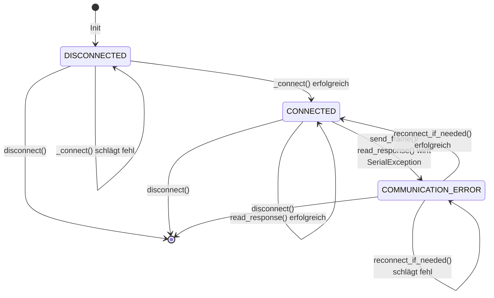

# USB-Verbindungsverwaltung (connection.py)

## Übersicht

Die `connection.py` verwaltet die serielle USB-Verbindung zu Funkgeräten (z.B. Icom) mit CI-V-Protokoll. Sie stellt Funktionen für verbindungsrobusten Datentransfer bereit, einschließlich automatischer Reconnect-Logik und Fehlerbehandlung.

**Datei:** `src/backend/transport/usb_connection.py` (vormals `usb/connection.py`)

**Hauptaufgaben:**
- Öffnen/Schließen der seriellen USB-Verbindung
- Senden und Empfangen von CI-V Frames
- Verwaltung des Verbindungsstatus mit Zustandsübergängen
- Automatische Reconnect-Versuche bei Fehlern
- Context Manager Support für sichere Ressourcenverwaltung

---

## Klassen und Enums

### `USBStatus` (Enum)

Definiert die möglichen Verbindungszustände.

```python
class USBStatus(str, Enum):
    DISCONNECTED = "disconnected"           # Kein USB-Port verfügbar
    COMMUNICATION_ERROR = "communication_error"  # I/O-Fehler bei Kommunikation
    CONNECTED = "connected"                 # Gerät erkannt und antwortet
```

| Status | Bedeutung | Ursache |
|--------|-----------|--------|
| `DISCONNECTED` | Keine Verbindung | Port nicht vorhanden oder nicht öffnbar |
| `COMMUNICATION_ERROR` | Kommunikationsfehler | SerialException beim Lesen/Schreiben |
| `CONNECTED` | Verbunden & aktiv | Port offen und Gerät antwortet |

---

### `USBStateMachine`

Verwaltet den aktuellen USB-Status und Zustandsübergänge mit Logging.

**Attribute:**
- `status: USBStatus` — Aktueller Verbindungsstatus
- `status_names: Dict[USBStatus, str]` — Lesbare deutsche Statusnamen

**Methoden:**

#### `__init__()`
Initialisiert die Zustandsmaschine im Status `DISCONNECTED`.

#### `update_status(new_status, config, error=None)`
Aktualisiert den Status und loggt den Übergang.

**Parameter:**
- `new_status: USBStatus` — Neuer Status
- `config: USBConfig` — Konfiguration (für Logging von Port/Baud)
- `error: str | None` — Optionale Fehlermeldung

**Beschreibung:**
- Nur auf Statusänderung (`new_status != self.status`) wird geloggt
- Loggt unterschiedliche Nachrichten je nach Übergang
- Bei `CONNECTED` ➔ `DISCONNECTED`: Error-Level
- Bei `DISCONNECTED` ➔ `CONNECTED`: Info-Level
- Loggt stets den deutschen Statusnamen für Leserlichkeit

#### `is_connected() -> bool`
Prüft, ob der Status nicht `DISCONNECTED` ist.

```python
return self.status != USBStatus.DISCONNECTED
```

#### `connected_no_error() -> bool`
Prüft, ob der Status exakt `CONNECTED` ist (keine Fehler).

```python
return self.status == USBStatus.CONNECTED
```

---

### `SerialFrameData` (Dataclass)

Kapselt ein einzelnes CI-V Frame mit Zeitstempel.

**Attribute:**
- `raw_bytes: bytes` — Rohbytes des Frames (z.B. `[0xFE, 0xFE, ..., 0xFD]`)
- `timestamp: float` — Unix-Timestamp (automatisch bei Erstellung gesetzt)

**Methoden:**

#### `__repr__() -> str`
Gibt eine lesbare Darstellung des Frames zurück:
```
SerialFrameData(bytes=14, hex=FE FE E0 94 03 00 45 50 00 00 00 FD)
```

---

### `USBConnection`

Verwaltet die physikalische serielle Verbindung zum Funkgerät.

**Attribute:**
- `config: USBConfig` — Port, Baud-Rate, Timeouts etc.
- `simulate: bool` — Wenn `True`, kein echtes Serial-Objekt (für Tests)
- `serial_port: serial.Serial | None` — Offenes Serial-Objekt
- `last_error: str | None` — Letzte Fehlermeldung
- `is_connected: bool` — Flag für Verbindungsstatus (deprecated)
- `usb_status: USBStateMachine` — Zustandsmaschine

**Methoden:**

#### `__init__(config, simulate=False)`
Initialisiert die USB-Verbindung.

**Parameter:**
- `config: USBConfig` — Verbindungskonfiguration
- `simulate: bool` — Tessmodus aktivieren

**Verhalten:**
- Falls `simulate=False`: Ruft sofort `_connect()` auf
- Falls `simulate=True`: Springt zu Status `CONNECTED` ohne echte Hardware

#### `_connect() -> bool`
Öffnet die echte serielle Verbindung (private Methode).

**Rückgabe:** `True` bei Erfolg, `False` bei `SerialException`

**Ablauf:**
1. Schließt alte Verbindung falls noch offen
2. Erstellt neues `serial.Serial` Objekt mit Config-Parametern
3. Setzt Status auf `CONNECTED`
4. Bei Fehler: Status `DISCONNECTED` + Error-Logging

#### `connect() -> bool`
Stellt sicher, dass die Verbindung offen ist.

**Verhalten:**
- Falls `simulate=True`: Setzt Status auf `CONNECTED` und gibt `True` zurück
- Falls bereits verbunden (Port offen): Gibt `True` zurück
- Ansonsten: Ruft `_connect()` auf

#### `disconnect() -> None`
Trennt die serielle Verbindung.

**Ablauf:**
1. Schließt `serial_port` wenn offen
2. Setzt Status auf `DISCONNECTED`
3. Fehler beim Schließen werden geloggt, blockieren aber nicht

#### `send_frame(frame_data) -> bool`
Sendet ein CI-V Frame über die serielle Verbindung.

**Parameter:**
- `frame_data: SerialFrameData` — Zu sendendes Frame

**Rückgabe:** `True` bei Erfolg, `False` bei Fehler

**Ablauf:**
1. Falls nicht verbunden: Versucht `reconnect_if_needed()`
2. Falls Simulation: Loggt [SIMULATION] und gibt `True` zurück
3. Sendet Bytes über `serial_port.write()`
4. **Bei Fehler:** 
   - Setzt Status auf `COMMUNICATION_ERROR`
   - Versucht einmalig automatischen Reconnect
   - Sendet Frame erneut falls Reconnect erfolgreich

#### `read_response(timeout=None) -> SerialFrameData | None`
Liest ein CI-V Frame von der seriellen Verbindung.

**Parameter:**
- `timeout: float | None` — Optionaler Timeout in Sekunden

**Rückgabe:** `SerialFrameData` bei Erfolg, `None` bei Fehler/Timeout

**Ablauf:**
1. Prüft, ob Port verbunden ist (oder Simulation läuft)
2. Liest Bytes bis Frame-Ende-Marker (`0xFD`) gefunden
3. Frame-Format erwartet: `0xFE 0xFE ... 0xFD`
4. Bei Timeout: Loggt unvollständiges Frame und gibt `None` zurück
5. Bei `SerialException`: Setzt Status auf `COMMUNICATION_ERROR`

**Frame-Struktur:**
```
0xFE 0xFE  [Header]
    0xE0   [Empfänger (Controller)]
    0x94   [Sender (Gerät)]
    0x03   [Command]
    0x00   [Subcommand]
    ...    [Daten]
    0xFD   [Ende-Marker]
```

#### `reconnect() -> bool`
Erzwingt einen Reconnect durch Disconnect + Connect.

**Ablauf:**
1. Ruft `disconnect()` auf
2. Wartet 0,5 Sekunden (für Port-Release)
3. Ruft `_connect()` auf

#### `reconnect_if_needed() -> bool`
Fehlertoleranz-Versuch: Reconnect nur wenn nötig.

**Verhalten:**
- Falls bereits verbunden (`connected_no_error()` ist `True`): Gibt `True` zurück
- Ansonsten: Wartet `config.reconnect_interval` Sekunden, dann `reconnect()`

**Zweck:** Verhindert sofortige Reconnect-Versuche bei transienten Fehlern

#### `__enter__() -> USBConnection`
Context Manager: Verbindung öffnen.

```python
with USBConnection(config) as conn:
    conn.send_frame(data)
```

#### `__exit__(exc_type, exc_val, exc_tb)`
Context Manager: Verbindung schließen (immer ausgeführt).

#### `__repr__() -> str`
Lesbare Darstellung:
```
USBConnection(/dev/ttyUSB0, verbunden)
```

---

## Status-Übergänge (Zustandsdiagramm)



### Typ der Übergänge

| Von | Nach | Auslöser | Automatisch? |
|-----|------|----------|--------------|
| `DISCONNECTED` | `CONNECTED` | Port öffnen erfolgreich | Ja (ja `connect()`) |
| `DISCONNECTED` | `DISCONNECTED` | Port öffnen fehlgeschlagen | Ja (Fehlerfall) |
| `CONNECTED` | `CONNECTED` | Frame senden/lesen erfolgreich | Ja |
| `CONNECTED` | `COMMUNICATION_ERROR` | SerialException bei I/O | Ja (Fehlerfall) |
| `COMMUNICATION_ERROR` | `CONNECTED` | Reconnect erfolgreich | Ja (automatisch in `send_frame()`) |
| `COMMUNICATION_ERROR` | `COMMUNICATION_ERROR` | Reconnect fehlgeschlagen | Ja (weiterhin Fehler) |
| Alle | `DISCONNECTED` | `disconnect()` aufgerufen | Ja (explizit) |

---

## Fehlerbehandlung & Resilienz

### Automatische Reconnect-Strategie

1. **Bei `send_frame()` Fehler:**
   - Setzt Status auf `COMMUNICATION_ERROR`
   - Ruft `reconnect_if_needed()` auf
   - Wartet `config.reconnect_interval` (z.B. 1 Sekunde)
   - Sendet Frame erneut
   - Gibt `True` (Erfolg) oder `False` (Fehler nach Retry) zurück

2. **Bei `read_response()` Fehler:**
   - Setzt Status auf `COMMUNICATION_ERROR`
   - Ruft `reconnect_if_needed()` auf asynchron (im Background)
   - Gibt `None` zurück (Lesefehler)

3. **Zeitouts:**
   - `read_response()` erwartet Daten bis zum `0xFD` Marker
   - Bei Timeout endet das Lesen, unvollständiges Frame wird geloggt
   - Status bleibt unverändert (nicht `COMMUNICATION_ERROR`)

---

## Nutzungsbeispiele

### Einfache Verwendung

```python
from src.backend.transport import USBConnection, TransportStatus
from src.backend.config.settings import USBConfig

# Konfiguration laden
config = USBConfig(port="/dev/ttyUSB0", baud_rate=19200)

# Verbindung öffnen
conn = USBConnection(config)

# Frame senden
success = conn.send_frame(SerialFrameData(bytes([0xFE, 0xFE, ...])))

# Response lesen
response = conn.read_response(timeout=1.0)

# Trennen
conn.disconnect()
```

### Mit Context Manager

```python
config = USBConfig(port="/dev/ttyUSB0", baud_rate=19200)

with USBConnection(config) as conn:
    # Verbindung ist automatisch offen
    response = conn.read_response(timeout=1.0)
    # Verbindung wird automatisch geschlossen
```

### Status prüfen

```python
from src.backend.transport import USBConnection, TransportStatus

conn = USBConnection(config)

if conn.connection_state.connected_no_error():
    print("Verbunden und bereit")
elif conn.connection_state.is_connected():
    print("Verbunden, aber Fehler")
else:
    print("Nicht verbunden")
```

---

## Logging & Debugging

Alle Zustandsübergänge und Fehler werden geloggt:

```
[INFO] USB-Statusänderung: GETRENNT -> VERBUNDEN
[INFO] USB verbunden: /dev/ttyUSB0 @ 19200 baud
[ERROR] USB Kommunikation verloren: No such file or directory
[DEBUG] [TX] Frame gesendet (14 bytes): FE FE E0 94 03 00 45 50 00 00 00 FD
[DEBUG] [RX] Frame empfangen (8 bytes): FE FE E0 94 03 00 45 50 FD
[WARNING] Versuche automatischen Reconnect nach Fehler...
[INFO] Reconnect erfolgreich, wiederhole Frame-Versand...
```

**Log-Level:**
- `DEBUG` — Frame-Details, Port-Operationen
- `INFO` — Statusübergänge, Reconnect-Versuche
- `WARNING` — Fehler, aber autoWiedherstellung möglich
- `ERROR` — Kritische Fehler (Kommunikation verloren)

---

## Abhängigkeiten

```python
import serial             # pySerial für serielle Kommunikation
import time               # Für Reconnect-Pausen
from pathlib import Path  # Für Pfad-Operationen
from typing import Optional
from dataclasses import dataclass
from enum import Enum

from ..config.logger import RigBridgeLogger
from ..config.settings import USBConfig
```

---

## Zukunftserweiterungen

- Konfigurierbare Retry-Strategien
- Metrik-Tracking (Fehlerzähler, Uptime)
- Event-Callbacks bei Statusänderungen
- Auslagerung in ein eigenständiges Modul
